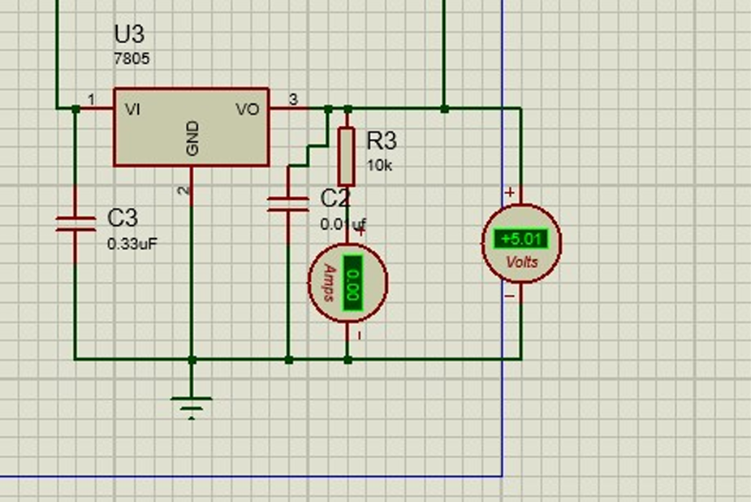
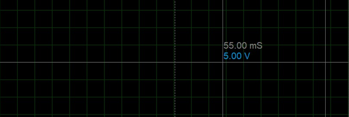
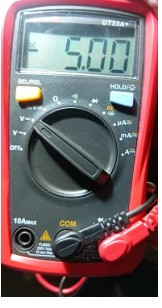
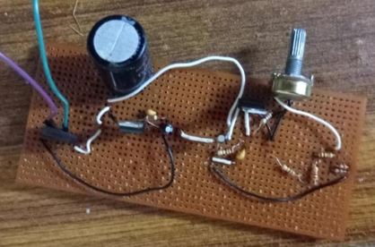
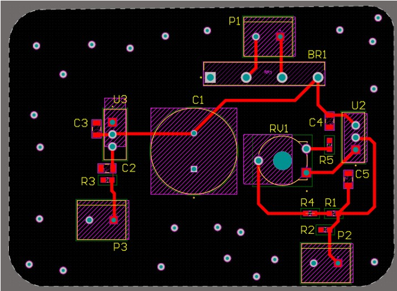
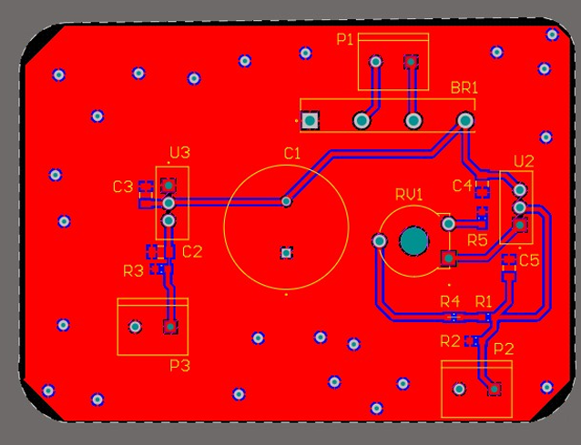

# 🔌 Dual Output DC Power Supply (2–24V Variable & Fixed 5V)

## 📌 Project Overview
This project focuses on the **design, implementation, and analysis of a dual-output regulated DC power supply** capable of delivering:

- **Variable DC output:** 2 V – 24 V using **LM317**
- **Fixed DC output:** 5 V using **7805**

The power supply converts **AC mains voltage** into a stable DC output using a transformer, bridge rectifier, filter capacitor, and linear voltage regulators.  
It is suitable for **laboratory experiments, circuit testing, and educational applications**.

---

## 🎯 Project Objectives
- Convert AC mains voltage into regulated DC
- Design a variable voltage regulator using LM317
- Provide a stable 5 V output for digital circuits
- Minimize ripple voltage using proper filtering
- Analyze performance using **MATLAB**
- Implement the design on **veroboard and PCB**

---

## 🧩 Components Used
- Step-down transformer (230 V → 24 V)
- Bridge rectifier
- Filter capacitor (4700 µF)
- LM317 adjustable voltage regulator
- 7805 fixed voltage regulator
- Potentiometer
- Resistors and capacitors
- Multimeter and oscilloscope

---

## ⚙️ Working Principle
1. AC mains voltage is stepped down using a transformer  
2. The bridge rectifier converts AC into pulsating DC  
3. A filter capacitor smooths the DC voltage  
4. LM317 provides adjustable output from 2 V to 24 V  
5. 7805 provides a fixed and stable 5 V output  

---

## 📐 Circuit Design & Layout

### Overall Circuit Layout

### Variable 2–24 V Regulator Circuit

### Fixed 5 V Regulator Circuit

---

## 📊 Input and Output Waveforms

### Input AC Waveform

### Variable Output Waveform (2 V)

### Variable Output Waveform (23.3 V)

### Fixed 5 V Output Waveform

---

## 🔍 Experimental Results

### Variable Output (Minimum Voltage)

### Variable Output (Maximum Voltage)

### Fixed 5 V Output

---

## 🧮 MATLAB Analysis

### Ripple Voltage with 4700 µF Capacitor

### Ripple Voltage vs Capacitance

### LM317 Output Voltage vs Potentiometer

### Power Dissipation in LM317

---

## 🛠 Hardware Implementation

### Veroboard Implementation

---

## 🖥 PCB Design

### PCB Routing

### PCB Routing (Improved)

### PCB 3D Model

---

## 📄 Documentation
A complete detailed project report is included in this repository.

---

## 👨‍💻 Authors
- **Sayem Ul Haq**
- **Anas Ur Rehman**
- **Talha Ahmad**

---

## 🏫 Institution
**NUST – College of Electrical and Mechanical Engineering**  
Department of Electrical Engineering

---

## 📜 License
This project is intended for **academic and educational use only**.
